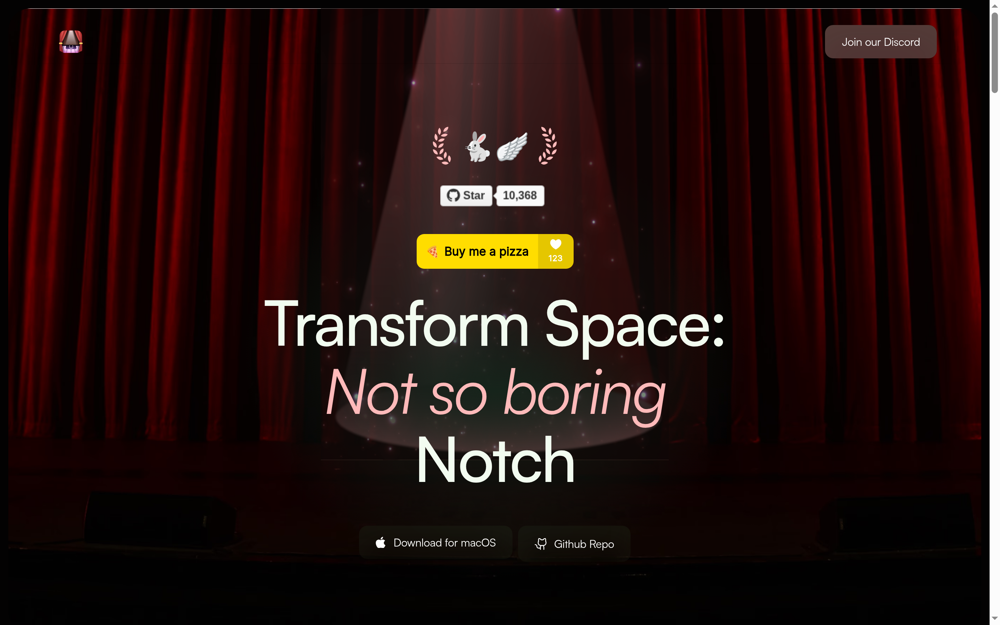

# Boring Notch

<p align="center">
  
</p>

This is Ziad's fork of [TheBoredTeam/boring.notch](https://github.com/TheBoredTeam/boring.notch).

Say hello to **Boring Notch**, the coolest way to make your MacBook's notch the star of the show. Your notch transforms into a dynamic music control center, complete with a visualizer and music controls, plus calendar integration, a file shelf with AirDrop support, and a complete macOS HUD replacement.

## Installation

**System Requirements:**

- macOS **14 Sonoma** or later
- Apple Silicon or Intel Mac

### Option 1: Download and Install Manually

Download the latest [boringNotch.dmg](https://github.com/TheBoredTeam/boring.notch/releases/latest/download/boringNotch.dmg). Open the `.dmg` and move **Boring Notch** to your `/Applications` folder.

> [!IMPORTANT]
> The upstream project does not have an Apple Developer account, so macOS will warn that Boring Notch is from an unidentified developer on first launch.
>
> After moving the app to Applications, run:
>
> ```bash
> xattr -dr com.apple.quarantine /Applications/boringNotch.app
> ```
>
> Then open the app normally.

### Option 2: Install via Homebrew

```bash
brew install --cask TheBoredTeam/boring-notch/boring-notch
```

## Building from Source

### Prerequisites

- **macOS 15.6 or later**
- **Xcode 26 or later**

1. Clone this fork or the upstream repository:
   ```bash
   git clone https://github.com/TheBoredTeam/boring.notch.git
   cd boring.notch
   ```
2. Open the project:
   ```bash
   open boringNotch.xcodeproj
   ```
3. Build and run with `Cmd + R`.

## Usage

- Launch the app and hover over the notch to expand it.
- Use the controls to manage music.
- Click the star in the menu bar to customize the notch.

---

Built by [Ziad Ahmed](https://github.com/Ziad-NasrEldin) at [MaVoid](https://mavoid.com).

[Website](https://mavoid.com) · [LinkedIn](https://linkedin.com/in/ziad-ahmed-634202332) · [GitHub](https://github.com/Ziad-NasrEldin)
